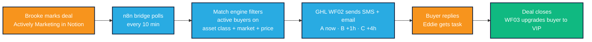

# Terms For Sale — Team SOP: Buyer Lifecycle

**Audience:** Deal Pros operations team. Read time: ~20 minutes cover-to-cover.

**What this document is.** The operating manual for the automated buyer lifecycle system — from seller lead in Notion, through matching and blasting buyers, through a closed assignment, back into buyer maintenance. Everything you need to run daily ops without asking Brooke.

**What this document is not.** A build guide. If you need to modify the workflows or custom fields, see `tfs-build/sop/TFS_Buyer_Lifecycle_Build_SOP.docx`.

---

## System at a glance

Terms For Sale dispositions creative-finance deals to a vetted buyer rolodex. The system runs on three tools that each do one thing well:

- **Notion** holds deal inventory. When a deal is ready for buyers, Brooke marks it Actively Marketing.
- **n8n** (self-hosted at n8n.dealpros.io) polls Notion every 10 minutes, pulls matching buyers from GHL, and fires the right tag on each matched contact.
- **GoHighLevel** owns the CRM — contacts, tags, SMS, email, pipeline, workflows. It sends the actual messages.

A full deal cycle: operator touches the system twice — once to mark Actively Marketing, once to verify the assignment fee after WF03 fires. Everything in between is automated. For the full map including decision points, see `flow-diagram.md`.

**Key terms used throughout.**
- **Buy box** — a buyer's stated criteria: asset class, market, price range, financing preference.
- **EMD** — Earnest Money Deposit. Paid by the buyer when the PSA is signed to secure the deal.
- **POF** — Proof of Funds. Bank statement or lender letter showing the buyer can actually close.
- **TC** — Transaction Coordinator. Third-party who runs the contract-to-close process.
- **Assignment fee** — our revenue. What the end buyer pays us to take over the original contract with the seller.

---

## Who does what

Everyone on the team has full GHL access. Ownership is about who runs the lane day-to-day, not who *can* click the button.

| Task | Responsible | Accountable | Consulted | Informed |
|---|---|---|---|---|
| Notion deal entry + Asset Class / Market / Price fields | **Brooke** | Brooke | — | Darise |
| Marking deal Actively Marketing | **Brooke** | Brooke | — | Team |
| New buyer onboarding (manual) | **Darise** | Brooke | — | Junabelle |
| Inbound buyer replies in GHL | **Junabelle** | Brooke | Eddie (if hot) | Brooke |
| Buy-box field updates in GHL | **Junabelle** | Brooke | — | — |
| Moving deals through disposition stages (Assigned → Closed) | **Junabelle** | Brooke | Eddie | Brooke |
| Acquisitions-side pipeline (Offer Submitted → Under Contract) | **Eddie** | Brooke | — | Brooke |
| Seller-facing communication on active offers | **Eddie** | Brooke | — | — |
| Contract drafting + e-signature + execution tracking | **Junabelle** | Brooke | — | TC, Brooke |
| EMD verification | **Junabelle** | Brooke | TC | Brooke |
| Assignment fee verification after close | **Brooke** | Brooke | Junabelle | — |
| Buyer alert complaints (wrong deals / no deals) | **Junabelle** | Brooke | — | Brooke |
| Facebook posts + group distribution | **Darise** | Brooke | — | — |
| InvestorLift postings | **Darise** | Brooke | — | — |
| Listing copy beyond auto-generated deal package | **Darise** | Brooke | — | — |
| Weekly review of Match Engine Log (zero-match deals) | **Brooke** | Brooke | Darise | — |

**The rule.** Responsible = owns the lane. Accountable = final review; at Deal Pros' current size, that's Brooke for everything. Consulted = gets pulled in when it matters. Informed = kept in the loop but doesn't act.

---

## The end-to-end flow, step by step

The full cycle, 12 steps, deal discovery to closed assignment. Each step lists who triggers it, what the system records, what runs automatically, and what the team confirms.

### 1. Deal lands in Notion

- **Who triggers:** Brooke. Deal comes in from Eddie (acquisitions) or direct sourcing.
- **System records:** New page in the TFS Deal Inventory Notion database.
- **Happens automatically:** Nothing yet. Status defaults to Draft.
- **Team confirms:** Brooke fills required fields: Name, Status, Asset Class, Market, Price, Deal Type, Summary URL, Address (internal only). Anything missing and the match engine skips it.

### 2. Brooke marks the deal Actively Marketing

- **Who triggers:** Brooke. One click in Notion — change Status from Draft to Ready to Blast. Leave Blasted unchecked.
- **System records:** Status = Ready to Blast in Notion.
- **Happens automatically:** Within 10 minutes, the n8n Notion Bridge polls and picks up the deal.
- **Team confirms:** Within 15 minutes, Notion shows Blasted = true with a timestamp. If it doesn't flip, see Troubleshooting.

### 3. Match engine runs

- **Who triggers:** Automatic. The Notion Bridge POSTs the deal to the match engine webhook.
- **System records:** n8n execution log at n8n.dealpros.io.
- **Happens automatically:** Engine pulls every buyer:active contact from GHL. Filters on three criteria: asset class overlap, market overlap, price band fit. Skips any buyer whose Last Deal Sent Date is within 24 hours (cooldown gate).
- **Team confirms:** Nothing to confirm in real time. Match count is logged — if it's zero, the engine writes to the Match Engine Log Notion DB for Brooke's Monday review.

### 4. Deal fields written to matched contacts

- **Who triggers:** Automatic.
- **System records:** Each matched GHL contact gets five fields updated: Deal Asset Class (latest), Deal Market (latest), Deal Price (latest), Deal Type (latest), Deal Summary URL (latest), Last Deal Sent ID.
- **Happens automatically:** These fields are what WF02 reads when it composes the SMS and email. They overwrite per deal — each matched buyer always shows the most recent match.
- **Team confirms:** Nothing. If you open a buyer's contact and see stale deal info, it means they haven't been matched to anything recent.

### 5. Webhook POST to WF02, staggered by tier

- **Who triggers:** Automatic.
- **System records:** In each tier branch, n8n POSTs to the WF02 webhook URL with the contact's email + 5 deal fields. Tier A fires immediately, Tier B after 1 hour, Tier C after 4 hours. The `deal:new-inventory` tag is still applied after the webhook call for history/reporting.
- **Happens automatically:** The webhook POST is what fires GHL WF02. n8n uses Wait nodes between tier branches so the send order is enforced at the n8n layer, not the GHL layer.
- **Team confirms:** Nothing in real time. If SMS doesn't arrive for a specific buyer after the expected delay, check n8n execution history for the match engine run and WF02 automation history in GHL for that contact.

### 6. GHL WF02 sends the deal alert

- **Who triggers:** Inbound webhook POST from n8n fires WF02 — Deal Match & Send. (Prior to 2026-04-20, the trigger was "Contact Tag Added"; migrated to webhook to eliminate an intermittent trigger-miss issue.)
- **System records:** SMS + email logged in GHL Conversations. Last Touch Date and Last Deal Sent Date updated on the contact.
- **Happens automatically:** Tier-specific message copy fires — A-tier gets "VIP ALERT", B-tier gets standard alert, C-tier gets basic alert. All three point to the Summary URL (address-gated deal page).
- **Team confirms:** Junabelle scans GHL Conversations through the day for replies. No proactive check needed per-send.

### 7. Buyer reacts

- **Who triggers:** Buyer replies to SMS or clicks the deal summary link in the email.
- **System records:** Inbound message in GHL Conversations. Click event on the link (if tracking is on).
- **Happens automatically:** WF02 has a 24-hour wait node. At the 24-hour mark, WF02 checks: did the buyer reply or click? If yes, move opportunity to Under Negotiation and create a 2-hour callback task for Eddie. If no, remove the tag and end.
- **Team confirms:** **Junabelle** watches the GHL inbox. When a reply comes in: verify the buyer's buy-box fields actually match the deal (guards against "I get every deal" complaints), then either let WF02's 24h timer run OR move the opportunity manually and notify Eddie via Slack if it's clearly hot.

### 8. Eddie calls the buyer

- **Who triggers:** Eddie gets the auto-created task.
- **System records:** Call outcome — Eddie adds a note to the contact.
- **Happens automatically:** Nothing at this stage. This is the point where a human sells the deal.
- **Team confirms:** Eddie moves opportunity from Under Negotiation → Offer Submitted when he sends the buyer the PSA.

### 9. Offer accepted, PSA executed

- **Who triggers:** Eddie (or DocuSign/PandaDoc webhook if configured).
- **System records:** Opportunity moves to PSA Executed stage.
- **Happens automatically:** Stage-triggered workflow confirms EMD deposit and title open; notifies rep.
- **Team confirms:** **Junabelle** verifies EMD with the title company. Drafts and sends the contract package. Coordinates with TC to start the file.

### 10. Handoff to close

**This is the most common failure point for fuzzy handoffs.** Make this exchange explicit every time:

1. Junabelle moves opportunity to Assigned.
2. Junabelle notifies Brooke in Slack: "Deal #X assigned, contracts out, TC notified."
3. Brooke verifies WF03 hasn't fired prematurely (it shouldn't — WF03 only fires on Closed stage).
4. Junabelle monitors the file through close with TC.

### 11. Deal closes

- **Who triggers:** Junabelle moves opportunity to Closed stage after TC confirms funding.
- **System records:** GHL opportunity stage = Closed.
- **Happens automatically:** **WF03 fires.** Applies tag buyer:vip. Updates Buyer Tier = A, applies engage:a-tier, removes lower-tier tags. Calls the n8n helper webhook to increment Deals Last 12 Months by 1. Updates Last Touch Date and Re-verify Due Date. Creates a 2-day task for Brooke: "Confirm assignment fee distributed." Sends Slack notification. Waits 7 days, then sends the "what's next" SMS to the buyer.
- **Team confirms:** **Brooke** verifies the assignment fee hit the bank. Reconciles against the title company's closing statement. Closes the GHL task.

### 12. Buyer recycled

- **Who triggers:** Automatic, 7 days after close.
- **System records:** Outbound SMS logged, Last Touch Date updated.
- **Happens automatically:** Buyer gets "you're now VIP, what's your next acquisition wishlist" message. Re-opens the dialogue for the next deal.
- **Team confirms:** If the buyer replies with updated criteria, **Junabelle** updates their buy-box fields in GHL. That's what keeps the list accurate.

---

## Daily / weekly / monthly task lists

### Daily — Junabelle

- [ ] Open GHL Conversations, scan the unread inbox.
- [ ] Respond to every inbound buyer reply within the same business day.
- [ ] For each reply: verify buy-box matches the deal before escalating.
- [ ] Move any hot reply opportunities to Under Negotiation and ping Eddie.
- [ ] Process opt-in/opt-out requests immediately (tag, legal requirement).
- [ ] End of day: review GHL Opportunities board for stuck deals (stage unchanged >3 days with no note).

### Daily — Darise

- [ ] Onboard any new buyers who came in the previous day via form or manual intake.
- [ ] For each new buyer: verify buyer:new tag is applied, initial buy-box fields populated.
- [ ] Post any new Actively Marketing deals to Facebook groups and InvestorLift.
- [ ] Distribute social hooks from the deal-package output.

### Daily — Brooke

- [ ] Check Slack for WF03 assignment-fee tasks — verify against the title closing statement.
- [ ] Review any n8n execution failures.

### Weekly

- [ ] **Monday (Brooke):** Open Match Engine Log Notion DB, filter to Reviewed = false. For each zero-match deal, either flag buyer coverage gap for Darise or fix the deal fields in Notion. Check off Reviewed.
- [ ] **Monday (Junabelle):** Audit buyer:active contacts with stale Last Deal Sent Date (>14 days). Flag buyers who might be dormant-flagged incorrectly.
- [ ] **Friday (Junabelle):** Pipeline scan — any opportunity in Under Negotiation or Offer Submitted for >7 days without a note gets a direct ping to Eddie.

### Monthly

- [ ] **1st of month (Brooke):** Verify the monthly 12-month rollover cron ran. Check the execution log for errors.
- [ ] **1st of month (Brooke):** Tier distribution sanity check. Target is ~10% A / 30% B / 60% C. If the list has skewed, WF01 scoring criteria need adjusting.
- [ ] **Mid-month (Brooke):** Review dormant list. Any buyer:dormant contact closed >1 deal historically should get a personal outreach.

---

## How to: common operations

### Adding a new deal to Notion (auto-blast)

**Who does this:** Brooke.

1. Open the TFS Deal Inventory Notion database.
2. New page. Fill in: Name, Asset Class, Market, Price, Deal Type, Summary URL, Address.
3. Leave Blasted checkbox **unchecked**.
4. Set Status = **Ready to Blast**.
5. Walk away. Within 10 minutes the Notion Bridge picks it up. Within 15 minutes Blasted should flip to true with a timestamp. Tier A matched buyers will have already received SMS by that point.
6. If Blasted is still false after 20 minutes, see Troubleshooting.

### Onboarding a buyer manually

**Who does this:** Darise.

1. GHL → Contacts → + Add Contact.
2. Fill required fields: First Name, Last Name, Email, Phone.
3. Apply tag: buyer:new.
4. In Custom Fields → Buyer Profile, fill in at minimum: Buyer Asset Class, Buyer Market, Buyer Price Min, Buyer Price Max, POF on File, Lead Source.
5. Save. This triggers WF01 (Buyer Intake & Scoring) — welcome SMS + email go out automatically, qualifier nudge follows 5 minutes later.
6. After the intake call (Brooke takes these), Brooke updates PoF on File / Deals Last 12 Months / Decision Maker and moves the opportunity to Intake Call Complete. WF01 scores the buyer A/B/C and flips them to buyer:active.

### Handling an inbound buyer reply in GHL

**Who does this:** Junabelle.

1. GHL Conversations → open the reply.
2. Read the buyer's message. Check their contact record — what was the latest deal sent to them?
3. **Before doing anything else:** check whether the buyer's buy-box fields actually match the deal they received. If they don't match, that's a match-engine bug — escalate to Brooke.
4. If the buy-box matches and the reply is hot: move the opportunity to Under Negotiation, create a task for Eddie, Slack-ping Brooke + Eddie.
5. If the reply is "remove me" or similar: apply tag buyer:cold, remove buyer:active, update the contact note.

### Marking a deal closed (assignment paid)

**Who does this:** Junabelle first, Brooke verifies.

1. TC confirms funding with Junabelle.
2. Junabelle opens the GHL opportunity for the buyer, moves stage → **Closed**.
3. WF03 fires automatically. Junabelle should see: tag buyer:vip added, Buyer Tier = A, Deals Last 12 Months incremented by 1, 2-day task for Brooke created, Slack notification sent.
4. **Junabelle Slacks Brooke:** "Deal #X closed, assignment fee [amount] expected."
5. **Brooke** reconciles against the title closing statement within 2 business days. Marks the WF03 task complete.

### Removing a buyer from rotation

**Who does this:** Junabelle.

1. GHL → open contact.
2. Remove tag buyer:active.
3. Apply tag buyer:cold or buyer:dormant.
4. Move the opportunity stage to Dormant.
5. Add a dated note explaining the reason.

### Re-sending a deal to a buyer who missed it

**Who does this:** Junabelle.

1. Verify the buyer is currently buyer:active and their buy-box matches the deal.
2. Manually set Last Deal Sent Date to a value >24 hours ago (this clears the cooldown).
3. Have Brooke POST directly to the match engine webhook with the deal JSON.
4. Confirm the buyer received the new send by checking GHL Conversations.

---

## Troubleshooting

| Symptom | First check | Second check | Route to |
|---|---|---|---|
| Deal not blasting (Notion shows Ready to Blast but Blasted still false after 20 min) | n8n.dealpros.io → Notion Bridge execution log | Notion integration still has access to the DB? | Brooke |
| Match engine ran but zero buyers matched | Match Engine Log Notion DB | Are the deal's Asset Class / Market fields spelled the same way as buyer fields? | Junabelle; Brooke if deal fields malformed |
| Buyer not receiving SMS (Tier A) | GHL WF02 workflow history (webhook trigger, fires on POST from n8n) | If WF02 fired: check GHL Conversations. If not: check n8n Match Engine execution history for the contact_id and confirm the `POST to WF02 Webhook` node succeeded | Junabelle first; Brooke if WF02 or n8n errored |
| Buyer not receiving SMS (Tier B or C) | Same as above — but note stagger delay (1h / 4h) | Is Last Deal Sent Date within 24h? Cooldown may have skipped them | Junabelle |
| Pipeline stage not advancing | Is the stage-change trigger workflow active in GHL? | Tag/permissions | Junabelle; Brooke if GHL workflow broken |
| Tag not applied | n8n execution log | GHL contact history | Junabelle first; Brooke if n8n-side failure |
| Buyer falsely flagged dormant | Was Last Touch Date updated on the most recent send? | If any workflow is skipping the Last Touch Date update, that's the bug | Brooke |
| WF03 didn't fire on Closed | GHL workflow history for WF03 | Confirm opportunity is actually in Closed stage | Junabelle; Brooke if history shows error |
| Monthly rollover didn't run | n8n execution log, 1st of month 9 AM Phoenix time | Cron node enabled? | Brooke |

### Historical: WF02 SMS gap — fixed 2026-04-20

**This issue is resolved.** Keeping the history here so the team understands the context if it's mentioned elsewhere.

**What used to happen.** When the match engine applied the `deal:new-inventory` tag via GHL's API, GHL's "Contact Tag Added" trigger intermittently missed the event — no SMS, no email, no Last Touch Date update. Tags applied via the UI fired reliably. Junabelle had a manual workaround: remove the tag, wait 10 seconds, re-apply via UI.

**What changed.** WF02's trigger was migrated from "Contact Tag Added" to an Inbound Webhook. The match engine now POSTs directly to the WF02 webhook in each tier branch (A/B/C) with the contact's email + the 5 deal fields. GHL identifies the contact by email. The tag application is preserved after the webhook call so the contact still shows `deal:new-inventory` for reporting/history — but the tag no longer triggers the workflow. The old tag-added trigger was deleted from WF02.

**Why this matters for you.** If you ever see a SOP reference or old Slack thread mentioning "the WF02 SMS gap" or a "remove and re-apply the tag" workaround — it's historical. If a buyer isn't receiving a deal alert today, the cause is something else: check n8n execution history for the match engine (look for the contact_id in the run data), then check WF02's automation history in GHL.

---

## Key links + access

| Tool | URL | Who grants access |
|---|---|---|
| GHL — Terms For Sale sub-account | Agency login via REI Built | Brooke |
| Notion workspace | notion.so — Deal Pros workspace | Brooke |
| Notion Deal Inventory DB | Pinned in the Deal Pros workspace sidebar | Brooke |
| Notion Match Engine Log DB | Pinned in the Deal Pros workspace sidebar | Brooke |
| n8n instance | n8n.dealpros.io | Brooke |
| Buyer qualifier form (public) | termsforsale.com/buyer-qualifier | — |
| GHL Private Integration token | GHL → Settings → Private Integrations | Brooke only |
| Slack — #tfs-ops channel | — | Brooke |
| Mailgun (email delivery) | Tied to GHL sub-account | Brooke |
| LC Phone (SMS delivery) | Tied to GHL sub-account | Brooke |

All three team members (Eddie, Junabelle, Darise) have full GHL access — same permissions as Brooke. Ownership of lanes is social, not technical.

---

## Known gaps + manual steps

| Gap | Workaround | Fix ETA |
|---|---|---|
| ~~WF02 SMS gap~~ — RESOLVED 2026-04-20 | — | ✅ Fixed — WF02 trigger migrated from tag to webhook |
| **Zero dead-letter logging** — if the match engine errors mid-run, no alert | Brooke checks n8n execution log Monday mornings | Implement dead-letter Notion log spec |
| **Reply parsing is manual** — "YES" replies don't auto-advance the opportunity | Junabelle moves stage by hand | Possible v2 — NLP parsing; low priority |
| **Weighted scoring not implemented** — WF01 is a 3-variable binary | Tier skew managed by manual criteria review monthly | v2 — weighted model with recency decay |
| **No buyer portal** — all flow is SMS/email/booking link | Current approach is working; no portal planned | v2+ |
| **12-month rollover cron** — currently documented but may not be live | Brooke verifies manually on the 1st | Confirm n8n workflow is enabled |

---

## Escalation ladder

**Tier 1 — CRM or data issue.** Junabelle owns. Covers: wrong deal sent to a buyer, buyer complaints about too many/too few alerts, tag mixups, opt-in/opt-out, stuck opportunity stages, contract/EMD coordination.

**Tier 2 — workflow or automation issue.** Junabelle diagnoses and escalates. Covers: workflow didn't fire, tag applied but no send, match engine returned unexpected results. Junabelle runs the first-check steps from Troubleshooting, then pings Brooke in Slack with: contact name + contact_id, deal name, timestamp, what the n8n log shows, what the GHL history shows.

**Tier 3 — system down.** Brooke owns. Covers: n8n.dealpros.io unreachable, GHL outage, Notion API broken, Mailgun or LC Phone bouncing.

**Rule of thumb for the team.** If the problem is visible in GHL or Notion data, it's Tier 1 or 2. If the problem is "nothing is responding at all," it's Tier 3. When in doubt, Slack-message Brooke with what you tried and what happened.
