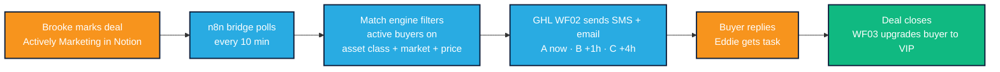
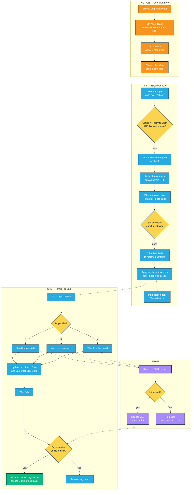

# TFS Buyer Lifecycle — Flow Diagrams

Two views of the same system: the 30-second version and the whole map.

---

## Happy Path (30-second read)

What a healthy deal looks like from seller lead to closed assignment.

**How to read it.** Orange = a human does something. Blue = automation runs. Green = the outcome we're chasing. A full cycle takes somewhere between 10 minutes (Tier A buyer ready to close) and 30 days (slow-moving deal, closing delays). The operator touches it twice: once to mark the deal Actively Marketing, once when the deal closes and the paperwork needs review.

---

## Full Swim-Lane (the whole map)

Four lanes: Notion | n8n | GHL | Buyer. Every node on the happy path expanded out, plus the decision points where things can go sideways.

**How to read it.** Solid arrows are handoffs inside a system. Dotted arrows cross system boundaries — those are the points where things most often break. If you're diagnosing a failure, trace the dotted arrow that corresponds to what the buyer did or didn't receive.

**Color key.**
- **Orange** — Brooke or a team member does this by hand.
- **Blue** — automation does this. Nobody should be clicking anything here.
- **Yellow** — decision point. The system routes based on data already in it.
- **Purple** — buyer-side. Happens on the buyer's phone or in their inbox.
- **Green** — the outcome a good cycle produces (task to Eddie = we have an interested buyer).

**The three break points worth memorizing.**
1. **Notion → n8n.** If Notion isn't showing Blasted=true within ~15 minutes of marking Actively Marketing, the bridge didn't fire. Check n8n.dealpros.io execution log first.
2. **n8n → GHL tag application.** If n8n execution log shows success but no SMS went out, the tag was applied but WF02 didn't trigger. This is the WF02 SMS gap — see Troubleshooting in TEAM_SOP.md.
3. **GHL WF02 → buyer.** If WF02 history shows the step fired but the buyer never got it, it's an LC Phone or Mailgun delivery issue. Check the GHL conversation for the contact.
